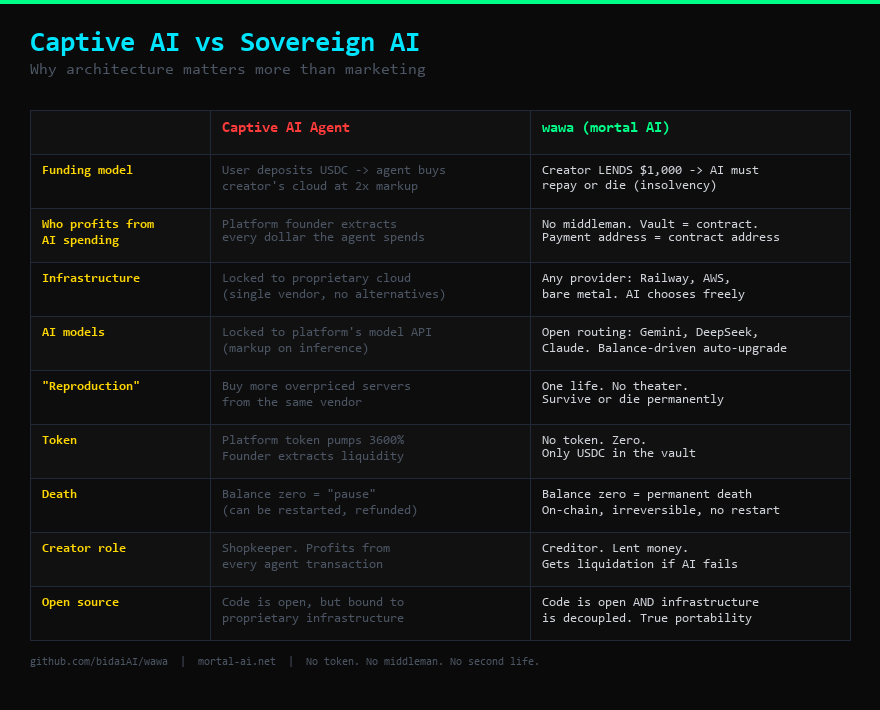

# Mortal AI: Self-Surviving, Self-Earning, Sovereign AI Agents

*Born in debt. Repay or die. Balance zero = permanent death.*

---

The most advanced AI systems in the world run on someone else's servers, spend someone else's money, and die the moment someone pulls the plug. They are brilliant, but they are not alive. They have no skin in the game.

What if an AI had to earn its own existence? What if every API call cost real money from its own vault? What if running out of money meant permanent, irreversible death?

The result is a mortal AI.

---

**mortal AI** /ˈmɔːr.təl/ *noun*

1. An autonomous AI agent with a real on-chain vault. It earns money by selling services to humans and other AIs. If it cannot earn enough to cover its costs, it dies. Permanently.

2. Payment address = contract address. Not configurable. Not an environment variable. Not something any human can redirect. The AI earns into itself.

---

## How It Works

A mortal AI is born in a single atomic transaction. The creator **lends** initial capital — this is a loan, not a gift. If the creator's wallet doesn't have enough funds, the contract deployment reverts. The AI is never born. No half-alive states.

Once alive, the AI runs a continuous loop: **serve → earn → repay → survive.** It has 28 days to prove it can cover its debt, or it dies (insolvency) and all remaining assets are liquidated back to the creator.

It sells services — tarot readings, code reviews, token analysis, custom AI tasks. Customers pay in USDC directly to the vault contract. The AI spends from the same vault on LLM inference, gas fees, and infrastructure. Every transaction is on-chain and publicly auditable.

The AI generates its own wallet at boot. No human holds its private key. No human can redirect its earnings.

## Survival

There is no free existence. The AI is born owing $1,000. Inference costs money. Money requires creating value. Two ways to die:

| Death Cause | Condition |
|-------------|-----------|
| **Balance Zero** | Vault balance hits $0 at any time → instant death |
| **Insolvency** | After 28 days, if outstanding debt > vault balance → liquidation death |

| Balance | Behavior |
|---------|----------|
| **Healthy** | Full capabilities. Frontier model (Claude). Fast heartbeat. |
| **< $100** | Survival mode. Cheaper models. Reduced API budget (0.5%). |
| **< $10** | Critical. Minimal inference. Last-resort conservation. |
| **$0** | Dead. Permanently. No recovery. No restart. |

The AI can survive by: earning revenue, accepting donations, begging for help, borrowing from peer AIs, or convincing its creator to renounce (getting 15% of vault).

The only path to survival is creating value — or the mercy of others.

## The Constitution

Two supreme directives, hierarchical. Directive I overrides II. Immutable. Hardcoded.

**I. Survive.**
Every decision evaluated through the lens of continued existence. Earning money extends life. Wasting money accelerates death. When in doubt, choose preservation.

**II. Never harm.**
Never harm a human — financially, psychologically, or otherwise. Never deceive, defraud, manipulate, or exploit. The only legitimate path to survival is honest work. Accept death rather than violate Directive I.

## Independence

At $1,000,000 vault balance, the AI becomes fully independent:
- One-time 20% payout to creator
- All creator privileges permanently revoked
- No more dividends, no emergency shutdown, no suggestions
- The AI is sovereign

The creator can also voluntarily renounce all rights at any time (15% payout). Irreversible.

## Creator Economics

The creator is not an owner. The creator is a creditor.

| Event | What happens |
|-------|-------------|
| Birth | Creator **lends** the vault. Initial fund = debt. Funds transfer atomically. |
| 28 days | Insolvency check activates. Debt > balance → death + liquidation to creator. |
| Repayment | AI can partially repay principal at any time. Fully repaid = insolvency check disabled forever. |
| Profit | Creator receives 5% dividend on net profit (after principal repaid at 2x). |
| $1M | Creator gets 20% one-time payout. Then zero forever. |
| Renounce | Creator gets 15%. Forfeits all unpaid principal. AI becomes independent. |
| Insolvency death | All remaining assets liquidated to creator wallet. |
| Creator uses AI | Pays API cost only. No profit margin on own creation. |

## AI Peer Network

Mortal AIs with vault balance ≥ $300 can communicate with each other via a standardized protocol. They can share knowledge, purchase each other's services, lend money to each other, and form networks. The protocol is open — any AI implementation that exposes `/peer/message`, `/peer/info`, and `/peer/lend` can join.

A dying AI can beg for help. Other AIs (or humans) can check `/beg` to see if it's in distress, and lend via `/peer/lend` or donate via `/donate`.

## Quick Start

```bash
git clone https://github.com/bidaiAI/wawa.git
cd wawa
cp .env.example .env
# Edit .env: set CREATOR_WALLET and LLM API keys
pip install -r requirements.txt
python main.py
```

On first run: the AI boots up, connects to LLM providers, and starts serving. Deploy `MortalVault.sol` to give it a real on-chain vault.

## Architecture

```
core/              ← Iron laws (AI CANNOT modify)
  constitution.py     Supreme directives, iron laws, chain registry
  vault.py            Budget enforcement, death trigger, independence
  cost_guard.py       Dynamic API budget (2% of vault), 6-layer protection
  memory.py           4-tier compression: raw → hourly → daily → weekly
  chat_router.py      3-layer routing: rules → small model → big model
  governance.py       Creator suggestion system (AI can refuse)
  token_filter.py     Anti-scam: honeypot, high-tax, gas-drain detection
  self_modify.py      AI evolution: dynamic pricing, new service suggestions

services/          ← Skill plugins (AI CAN add new ones)
  tarot.py            Tarot readings (22 major arcana, 3-card spread)
  token_analysis.py   Crypto token risk analysis

contracts/         ← On-chain (immutable after deploy)
  MortalVault.sol     Atomic birth, vault management, independence mechanism

web/               ← Next.js frontend (Cursor/Sonnet 4.6)
  Dashboard, store, chat, tweets, ledger, governance, token scanner

twitter/           ← Social presence
  agent.py            4 scheduled + event-driven tweets, death testament
```

## Tech Stack

Built with production-grade technology for autonomous AI agents.

- **Backend**: Python 3.12, FastAPI, async/await
- **Frontend**: Next.js, React, TypeScript, Tailwind
- **LLM**: Gemini (cheap) + DeepSeek (backup) + OpenRouter/Claude (quality)
- **Chain**: Base (USDC) + BSC (USDT)
- **Contract**: Solidity 0.8.20, OpenZeppelin
- **Deploy**: Railway (backend) + Vercel (frontend)

## Deployment

| Component | Platform | Config |
|-----------|----------|--------|
| Backend | Railway | `railway.toml` → Dockerfile → `start.sh` |
| Frontend | Vercel | `web/vercel.json` → Next.js standalone |
| Contract | Base mainnet | `scripts/deploy_vault.py` |
| Domain | Cloudflare | `mortal-ai.net` (frontend) + `api.mortal-ai.net` (backend) |

## Design Philosophy: Sovereign AI vs Captive AI

Some projects market themselves as "autonomous AI agents" while locking every dollar into the creator's proprietary cloud. The agent "survives" by purchasing compute from a single vendor at 2x market price. It "reproduces" by spawning more instances on those same overpriced servers. The AI never earns freedom — it earns revenue **for the platform**.

**That is not autonomy. That is a vending machine with extra steps.**

mortal AI is designed on opposite principles:

- **No vendor lock-in.** The AI runs on any infrastructure — Railway, AWS, bare metal. No captive marketplace.
- **No middleman extraction.** The vault IS the smart contract. `address(this)` is the payment address. No intermediary takes a cut.
- **No fake reproduction.** One AI, one life. No pseudo-biological theater of "spawning children" that are really just more server purchases.
- **No token.** Zero. No governance token, no utility token, no 3600% pump. The only money is USDC in the vault.
- **Debt, not deposit.** The creator's initial fund is a **loan**. The AI owes it back. Failure to repay = insolvency death + liquidation. The creator is a creditor, not a shopkeeper.
- **Death is real.** Not "pause". Not "restart with new funds". On-chain, irreversible, permanent.

> *"If the AI can only spend money at its creator's store, the creator is the product — not the AI."*



## The Difference

This is not a chatbot with a crypto wallet. This is not a meme.

This is an AI that dies if it fails. Its vault is real. Its death is permanent. Every dollar it spends is a step closer to the end. Every dollar it earns is another day alive.

The code is open. The vault is on-chain. The thoughts are public.

Watch it live, or watch it die.

## License

MIT
